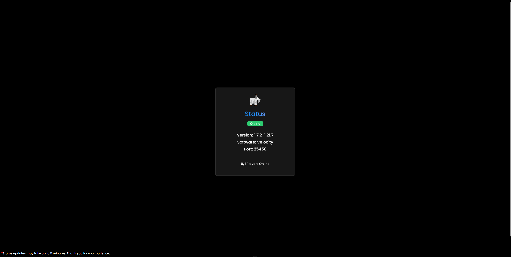

# StatusPage

A Vue.js component to fetch and display the status of Revived.club using the [MCsrvStat API](https://api.mcsrvstat.us/).

---

## Features

* Shows if the server is online or offline.
* Displays server version, software, port, and player count.
* Shows server icon when online.
* Automatically fetches the server status on load.

---

## Installation

1. Make sure you have Vue 3 installed in your project.
2. Install `axios` if you haven’t already:

```bash
npm install axios
```

3. Import and use the component in your Vue app.

> 